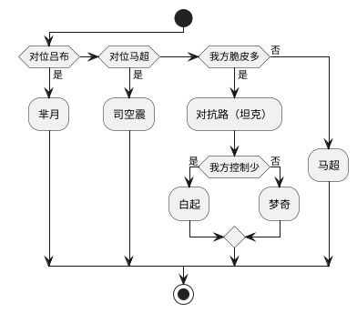
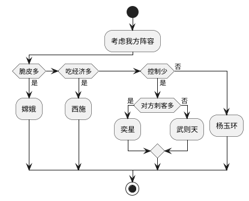
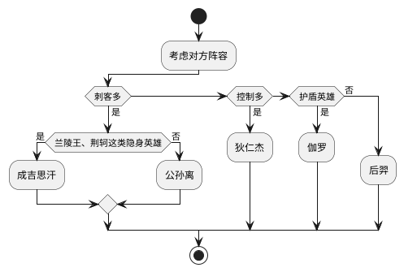
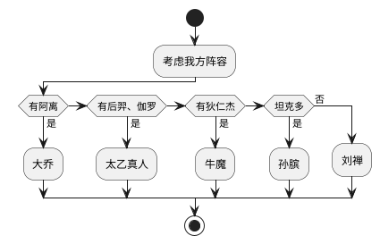

# 英雄列表

共 102 位英雄。

英雄梯度的所有排序皆按照我内心的主观判断，个人意愿强烈。

大体从逻辑上来说主要依据是胜率，其次是高端局登场率，再者就是功能的不可替代性，以及对其他英雄的补益和克制价值。

### 对抗路（坦克）

共 11 位英雄。

这其中梦奇、钟无艳、狂铁、亚瑟、吕布主职业是战士，但是这几位也都有着堪比坦克的承伤，所以也归类为坦克型对抗路，剩余的几位主职业都是坦克。

其他主职业为坦克的英雄中，阿古朵为打野，而廉颇和苏烈辅助更常见。

| 评级\类型 | 单带型     | 控制型 | 爆发型 | 全图型 |
| --------- | ---------- | ------ | ------ | ------ |
| T0        | 梦奇       | 白起   | /      | /      |
| T1        | /          | 猪八戒 | 钟无艳 | 刘邦   |
| T2        | 亚瑟、狂铁 | 夏侯惇 | /      | /      |
| T3        | 程咬金     | 项羽   | 吕布   | /      |

-   单带型坦克有着出色的单挑能力，伤害够足，而控制和团战能力并没有那么出色。
-   控制型坦克有着较多的控制技能，适合打团，相对输出比较薄弱。
-   爆发型坦克在开大期间拥有一定爆发能力，能对敌方 C 位造成一些威胁。
-   全图型坦克能全图支援，尤其适合四一分带。

### 对抗路（战士）

共 14 位英雄，其中李信分为光、暗两个形态。

| 评级\类型 | 高速型     | 单带型 | 控制型 | 突进型       | 全图型 | 远距型     |
| --------- | ---------- | ------ | ------ | ------------ | ------ | ---------- |
| T0        | 马超       | 芈月   | 元歌   | 花木兰       | 哪吒   | /          |
| T1        | 关羽       | /      | /      | 蒙恬         | /      | /          |
| T2        | /          | 老夫子 | 达摩   | 杨戬、夏洛特 | /      | /          |
| T3        | 李信（暗） | /      | 孙策   | 曜           | /      | 李信（光） |

-   高速型战士有着全峡谷最为出色的移动支援能力。
-   单带型战士有着出色的单挑能力，伤害够足，而控制和团战能力并没有那么出色。
-   控制型战士有着出色的控制技能，经常一套连招打得敌方动弹不得。
-   突进型战士有着一定的位移能力，能对敌方 C 位造成一些威胁。
-   全图型战士能全图支援，尤其适合四一分带。
-   远距型战士目前只有李信（光），李信（光）是极少见的靠远程输出为主的战士，作为高地保安而闻名。

### 中路

共 26 位英雄，不包括元歌，元歌以上路为主。

中路英雄中，只有司马懿主职业是刺客，其他主职业都是法师（重开时要注意哦，另外容易搞混的：露娜主职业是战士，孙膑和钟馗主职业是辅助）。

主职业为法师的英雄中，只有芈月是上路，其他都是中路。

中路英雄都是法术伤害。

| 评级\类型 | 控制型       | 中核型       | 突进型           | 爆发型 | 远距型         | 推塔型 | 功能型 |
| --------- | ------------ | ------------ | ---------------- | ------ | -------------- | ------ | ------ |
| T0        | 武则天、奕星 | 嫦娥、杨玉环 | 不知火舞、司马懿 | /      | /              | /      | /      |
| T1        | 女娲、西施   | 高渐离、貂蝉 | 上官婉儿         | 小乔   | /              | /      | /      |
| T2        | 墨子、张良   | 扁鹊         | /                | /      | 沈梦溪         | 周瑜   | /      |
| T3        | 王昭君       | 诸葛亮       | /                | 安琪拉 | 嬴政、干将莫邪 | /      | 姜子牙 |
| T4        | 甄姬         | /            | /                | 妲己   | /              | 米莱狄 | /      |

-   控制型法师的技能都带有一定的控制效果，如眩晕、冰冻、击退、击飞等效果，也有奕星棋盘和女娲矩阵这样限制位移的控制，以及西施强制位移的控制，最甚者是张良的支配控制。控制型法师并不依赖经济，可以出肉装如冰心和魔女。
-   中核型法师很依赖经济，并且需要近身打出伤害，所以也会出一定的肉装和回复装。中核型法师几乎没什么控制，但有一定的突进能力和比较强的持续作战能力。比较特殊的是杨玉环和扁鹊，也可以划分为治疗型法师。
-   突进型法师都有一些比较出色的位移技能，故在队伍中可以承担起切 C 的责任。
-   爆发型法师的技能也有一定的控制效果，但与控制型法师的主要区别还是他们要靠技能打伤害秒人，所以一般不出肉装。
-   远距型法师手特别长，类似于远程的中核型法师，同样依赖经济和缺少控制，并且缺乏收割能力。
-   推塔型法师对防御塔能造成额外伤害。能很快地扩大优势，在人机局价值颇大，劣势局乏力。
-   功能型法师目前就姜子牙一个，能快速提升队友的经验，吃体系配合，路人局选出来一般都比较乏力。姜子牙也可以当做远距型法师。

### 发育路

共 14 位英雄。

发育路英雄的主职业都是射手，都是物理伤害。

| 评级\类型 | 站桩型             | 位移型         | 免疫型 | 技能型 | 远距型   |
| --------- | ------------------ | -------------- | ------ | ------ | -------- |
| T0        | 后羿、伽罗         | 公孙离         | 狄仁杰 | (艾琳) | /        |
| T1        | 成吉思汗、鲁班七号 | 李元芳、孙尚香 | /      | 蒙犽   | /        |
| T2        | 黄忠               | 马可波罗       | 虞姬   | /      | 百里守约 |

-   站桩型射手拥有所有射手中最高的输出，但是没有位移手段。
-   位移型射手有一定的位移能力，使用较为灵活。
-   免疫型射手有一定的自保能力，如虞姬免疫物攻、狄仁杰免疫控制。
-   技能型射手靠技能作为主要的输出手段，平 A 输出较低，拆塔较慢。
-   远距型射手输出距离特别长。

### 打野

共 21 位英雄。

<!--
阿古朵、凯、典韦、雅典娜、宫本武藏、刘备、赵云、曹操、露娜、盘古、孙悟空、李白、澜、镜、阿珂、韩信、兰陵王、娜可露露、橘右京、百里玄策、云中君、裴擒虎

| 评级\类型 | 发育型 | 控制型 | qi 型 | 全图型 |
| --------- | ------ | ------ | ----- | ------ | -->

### 游走

共 17 位英雄。

<!-- 牛魔、张飞、廉颇、苏烈

| 评级\类型 | 单带型 | 控制型 | 爆发型 | 全图型 |
| --------- | ------ | ------ | ------ | ------ |
| T0        | 梦奇   | 白起   | 钟无艳 | /      | -->

<!-- ## 英雄关系

### 上单位

自闭位，大部分时间都在孤独 sala，所以克制关系影响很大。

#### 上单克制关系

-   梦奇 -> 高速类英雄（如马超、关羽）
-   梦奇 -> 全图类英雄（如哪吒、刘邦）
-   梦奇 -> 回复类坦克（如白起、猪八戒、程咬金）
-   梦奇 -> 爆发类坦克（如廉颇）
-   梦奇 -> 回复类战士（如夏洛特、杨戬、亚瑟）
-   梦奇 -> 蒙恬、芈月、钟无艳
-   芈月 -> 老夫子、吕布、哪吒、花木兰、达摩、孙策、狂铁、项羽、夏侯惇
-   哪吒 -> 元歌、曜、曹操、李信
-   白起 -> /

#### 上单钟爱队友

-   芈月 -> 嫦娥、伽罗、镜、大乔
-   梦奇 -> 弈星、不知火舞、张良、孙尚香、裴擒虎、东皇
-   哪吒 -> 貂蝉、高渐离、露娜、云中君、太乙真人
-   白起 -> 杨玉环、成吉思汗、公孙离、韩信、孙膑，孙白杨体系 -->

<!-- #### 射手克制关系

-   后羿 -> 杨玉环、裴擒虎、太乙
-   公孙离 -> 马可波罗 -->

# 英雄详解

## 对抗路

**选取思路**

### 梦奇

**出装**

法穿鞋、黄刀、血书、巫妖、帽子、法穿

### 芈月

**出装**

法穿鞋、黄刀、血书、时光、巫妖、帽子

### 白起

**铭文**

不用想太多，标准坦克铭文：调和 + 宿命 + 虚空

**对面有真伤时的出装**

## 中路

**选取思路**

### 弈星

## 发育路

**选取思路**

**护盾英雄一览**

-   上路，如钟无艳、吕布、狂铁、刘邦、夏侯惇
-   中路，如嫦娥、嬴政、王昭君、安琪拉
-   打野，如雅典娜、刘备、孙悟空
-   辅助，如张飞、钟馗、瑶
-   常出护盾装备类英雄，如马克出魔女、关羽出救赎

### 公孙离

**被动：伞**

-   放伞属于有轨迹位移，收伞属于瞬移
-   在 4 秒内，只有第一个技能放伞的位置可以回，之后的技能都会立刻进入冷却

**被动：印记**

-   叠第 4 层印记的时候爆炸，爆炸伤害继续能叠加 1 层印记，等价于每 3 层触发一次爆炸
-   印记无变化 5 秒后，会消失

**被动：爆炸**

-   法术伤害，受攻击力和法术穿透影响
-   受到爆炸伤害也会叠加一层印记
-   在叠加第 4 层印记前被普攻打死，无法触发爆炸
-   塔同样能叠加印记，并对周围造成爆炸伤害，但是塔本身不受技能伤害的影响所以不会掉血

**被动：额外普攻**

-   不能暴击，但可以触发装备特效
-   4 秒时间到，被动收伞之后也会触发额外普攻

**被动：加速**

-   50 加速只受铭文影响，不受装备影响
-   速度超过 500 后增益减半，速度低于 250 后减益减半

**被动：攻击间隔**

-   相当于提升 20% 攻速，但是同时还是得考虑攻速阈值

**二技能：霜叶舞**

-   使用完有一定后摇时间无法普攻
-   伞以释放技能位置为中心，随机位置出现，逆时针旋转，不会跟随英雄移动
-   技能特效是法术伤害，两段伤害间隔 1/3 秒，会跟随英雄移动（包括阻挡飞行物）
-   一旦收伞会立刻停止技能伤害和特效，比如第二段伤害未结算前收伞伤害会消失
-   阿离的普攻射程比其他射手短，而二技能和其他射手的普攻范围一致
-   看似是飞行物却挡不了的技能有：
    -   防御塔
    -   钟馗的钩，孙策的船，鲁班的扫射，宫本的空明斩，米莱狄的飞机（子弹可挡）
    -   从空中落下的：如黄忠的大，鲁班的大，云中君的大，武则天的大，司空震的大，沈梦溪的一和大，嬴政的一，周瑜的二，东皇的二
    -   在地上有范围的：马可的大，嫦娥的大，大乔的大
-   看似不是飞行物却能挡的技能有：
    -   婉儿的大，甄姬的大（未散开前），奕星的棋子，墨子的炮和范围伤害，老夫子的戒尺

**狂暴**

**打法思路**

-   开局二技能+买鞋到快出基地再卖，因为公孙离移动速度在射手中算低
-   到线上观察对方中路辅助是否露头
-   前期可以到对方那个草丛埋伏，先 a 再 2 再狂暴
-   越塔常用连招，1a2a1 回
-   可以在 1 之后多次平 a，不要在 2 之后平 a，因为 2 有明显后摇无法平 a
-   建立优势后，可以 1 拿了对方血包再回，再去中路支援
-   需要输出距离的时候，a3a3a1a2a1 回

### 狄仁杰

-   技能：闪现
-   铭文：10 夺萃、10 鹰眼、3 无双 7 祸源
-   出装：匕首、**冷静之靴**、速击之枪、**末世**、**无尽战刃**、陨星、**暗影战斧**、穿云弓、速击之枪、**破晓**、风暴巨剑、**泣血之刃**

### 伽罗

-   技能：净化

### 后羿

-   技能：闪现

### 成吉思汗

-   技能：闪现

### 孙尚香

-   出装有：战斧流、暴击流
-   1 之后注意调整输出位置再攻击
-   卡 1 技能被动，留 1 枪，见到人先手 2 技能，可以瞬间打出 2(1 技能被动)13 一共 4 个技能的伤害。

## 打野

**整体思路**

-   能入侵对方野区，坚决不刷自家野，吃掉对方 100 经济等于我方多 200 经济
-   不要看到塔就退缩，估算好塔的血量消耗值，对方在塔下是最松懈的，往往是突破节奏的好机会

**边边边边中思路**

-   按照先推对方 2 座**边外塔** -> 2 座**边中塔** -> **中外塔**的顺序推进，因为中外塔是很难拔的，但是推掉 2 座边中塔之后就顺理成章可拔
-   抓哪一条边的考量点：
    -   没有位移
    -   脆皮
    -   打法较凶
-   推完之后，大概 8、9 分钟，不用急着压高地，等到 10 分钟拿了龙再压
-   拿了主宰之后，注意先清两边兵线，留着中路兵线最后清，以达到三路兵线一同进高地的局面

### 露娜

-   手速快，就是一切
-   得学会秒换复活甲、秒换金身

## 游走

**选取思路**

### 太乙真人

-   一技能，对面有位移就直接炸，对面没有位移才考虑连控
-   一技能，在还剩三分之一的时候，就可以二技能或者闪现连上
-   大招宁早不晚：如队友被集火时或者冲入人群时，直接放；脆皮半血，直接放
-   注意队友有没有名刀，有的话得过零点几秒再放

### 孙膑

滑啊滑，滑就完事了

主学 2 技能

**2 技能**

-   除了抬血，还可以减团队的 cd，所以放大前可以先开 2 技能

**出装 + 铭文**

-   装备
    -   辅助装：近卫荣耀 + 救赎之翼，配合 2 技能抬血效果更好
    -   冷却拉满：冷静之靴 15 + 极寒风暴 20
    -   法防装：TODO
-   铭文
    -   得带肉铭文，因为技能法术加成低

**谨记**

-   不要带节奏，等队友向前走的时候再放 2 技能跟着上

### 大乔

这英雄好难找节奏啊啊啊，学不会，不知道咋玩

主学 1 技能

**被动：提升队友移速**

-   大乔在草外队友在草内不会有线，队友在草外大乔在草内会有线，明世隐的链子同理

**一技能：击退（主升）**

-   团战时限制敌方刺客
-   可以打断持续施法
-   追击和逃跑时都可以往路线上放，配合被动满级提升 90% 移速

**二技能：电梯**

-   害怕击退和击飞
-   因为有 4 秒延迟，逃跑时放在路径上，而不是放在脚下
-   回城时间是 8 秒，所以如果正好在泉水，可以在队友回城 5 秒左右的时候在泉水放技能
-   不会打断持续施法，刘邦放大可以继续引导
-   可以改变敌方哪吒、宫本大招的落点
-   要养成随手放二技能的习惯，但不能限制队友走位
-   探草前要先放二技能，用一技能或三技能探草
-   二技能应该放在大招靠后，安全明显的位置
-   二技能切忌放到敌方人群中或者队友脚下
-   适配英雄
    -   公孙离、李白，最适配
    -   芈月、司马懿，都自身能回血，而且没蓝条，不太需要电梯
    -   梦奇、元歌，比较难配合

**三技能：沉默**

-   触碰到即可造成沉默，可以放在敌方前后排之前切割战场
-   可以放在敌方公孙离伞的位置下
-   沉默可以沉默平 A

**大招：传送阵**

-   可以增加队友攻速
-   主要功能：快速集结（速推）、补充状态、远程求助、远程救援
-   使用时会暴露给敌方视野，偷龙时禁用（除非大优势）
-   CD 很长，满级 60 秒，宁可攒着不用也别随便乱用
-   切忌放到敌方防御塔下

**召唤师技能：干扰**

-   大乔二技能越塔机会多，干扰较适配
-   敌方控多则带净化

**出装 + 铭文**

大乔的核心玩法就是集合推塔，所以攻速必不可少，极影满上

另外大招 cd 太长冷却很重要，而被控放不出技能来大乔就很被动，属于法师可以考虑出双鞋

因为是软辅，不是主承伤位，可以考虑出点法装提升输出，或者梦魇之类的功能装

-   出装
    -   以减 cd 为主：冷静之靴 15、极影 6-10、极寒风暴 20
    -   双鞋：抵抗之靴
    -   辅助装：奔狼徽章
    -   法防装：永夜守护
-   铭文
    -   cd 满了，带心眼

**其他要注意的**

-   主跟中路或打野带节奏，除非射手是阿离可以跟着打配合
-   二技能回城前 0.5 秒左右按大招传送可以迅速回城
-   奔狼徽章不要乱开，cd 较长可以留着关键时刻用

### 牛魔

_保护能力较强的辅助，控制颇多_

主学 1 技能

**大招**

-   闻名的大闪
-   在草里释放对方是看不到前摇的

**召唤师技能：治疗**

-   治疗：稳定收益
-   弱化：双重减伤
-   闪现：大闪

**冷却向 出装+铭文**

牛魔站着不动都能发挥作用，所以不是那么吃冷却，打一套控制也足矣，被控也不是那么紧要

不过能堆冷却还是尽可能堆一下的，但是像冰痕、暗影之类不适配的装备没必要出，尽可能也不要让冷却溢出

另外感觉自身有加防，边际效应可以不用继续带近卫来加防

-   出装
    -   冷却部分：冷静之靴 15、极影 10
    -   辅助装：救赎之翼，配合自己被动性价比很高
    -   物抗装：冰霜冲击，能很好地配合牛魔自身的减速叠加晕眩
    -   魔抗装：永夜守护
    -   后期神装：不知道带啥出个霸者重装，总没错
-   铭文
    -   硬辅标配，调和虚空宿命

**抵抗向 出装+铭文**

当对方控多时，还是出抵抗之靴更好些，那就可以配冰心了

-   出装
    -   冷却部分：极影 10、极寒风暴 20，同时也弥补了下物防
    -   魔抗装：抵抗之靴
    -   同样要出救赎之翼、永夜守护、霸者重装
-   铭文
    -   差 5cd 正好配虚空

### 刘禅

是一个在优势时能快速推搭、前期强势的英雄，缺点是手短、容易被放风筝

主学 1 技能

**大招**

-   大招期间可以使用 1、2 技能和普攻，普攻还能减速 50%

**召唤师技能：晕眩**

-   晕眩：最稳
-   闪现：1 技能 A 闪，2 闪
-   疾跑：和闪现一样，也是解决自己手短的问题

**极影向 出装+铭文**

-   出装
    -   冷却部分：冷静之靴 15、极影 10、冰痕之握 10，冰痕增加冷却的同时能提升坦度，也适合刘禅平 A 多
    -   魔抗装：永夜守护
    -   奔狼纹章，弥补自身手短的缺点
    -   最后一件补暴烈之甲，弥补一些移速
-   铭文
    -   还差 5cd 满冷却，正好配合 10 虚空

**近卫向 出装+铭文**

队友不吃攻速，或者极其需要保护时出。

-   出装
    -   辅助装：近卫荣耀、奔狼纹章
    -   冷却部分：冷静之靴 15、极寒风暴 20
    -   同样出永夜守护和暴烈之甲
-   铭文
    -   同样差 5cd 配 10 虚空

# 其他

## 整体英雄数据

每个分路的总和应该是 200% 左右，看看玩什么路更容易上分。

每 1%都视作一个分段：

-   \>= 51.5% 极好
-   50.49%-51.5% 较好
-   49.49%-50.5% 一般
-   48.49%-49.5% 较差
-   < 48.49% 极差

以 2021-03-07 22:10:09 巅峰 1350 分以上数据作为基准：

**对抗路（战士）**

**对抗路（坦克）**
**中路**
**发育路**

总和 197.4%，比较符合预期，说明至少有 1.3% 的阵容是不选射手的，毕竟史前也流行过双边。

-   极好 10.2%（后羿）
-   较好 23.9%（成吉思汗、狄仁杰）
-   一般 133.3%
-   较差 30%（黄忠、孙尚香）

整体来看其实射手一般占据了大头，很难靠射手一个人来决定一场比赛的走向，接近 50% 使用率最高的马克胜率也接近 50% 更是说明了这一点。

**打野**

-   极好 %
-   较好 %
-   一般 %
-   较差 %
-   极差 %

**游走**

总和只有 171.8%，说明甘当辅助还是一件很稀有的事情，有近 15% 的阵容都是些稀奇古怪的辅助。

-   极好 31.1%（牛魔、大乔、太乙真人）
-   较好 62.8%
-   一般 42.7%
-   极差 35.2%（很吃惊廉颇也在这一档）

整体来看，相比没有辅助的阵容，有辅助的阵容一般都表现会较好（差不多就是较好高出那 20%）

## 英雄组合体系

**孙膑 + 白起 + 杨玉环**

后期三人一起行动，孙膑和杨玉环双抬血，基本死不掉

**公孙离 + 大乔**

大乔二技能传送，配合公孙离任意技能回伞能瞬间满状态

## 英雄克制关系

-   真伤英雄 -> 护盾英雄
-   伽罗 -> 嫦娥
-   吕布 -> 梦奇
-   狄仁杰 -> 李元芳

## 目标达成

**对抗路**

-   白起：市百强 2021 年 03 月 15 日

**中路**

-   区百强 2021 年 03 月 15 日
-   西施：市百强 2021 年 03 月 15 日
